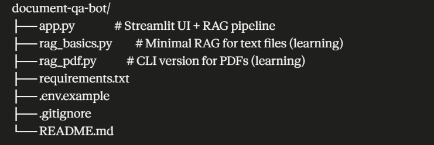

# 📄 Document Q&A Bot

A Retrieval-Augmented Generation (RAG) chatbot that lets you upload any PDF and ask questions about its contents. Returns answers grounded in the actual document with page-level citations.

## Features

- 📤 Upload any PDF document
- 💬 ChatGPT-style chat interface
- 📚 Every answer cites the exact pages it pulled from
- 🚫 Refuses to answer when the document doesn't contain relevant information (no hallucinations)
- ⚡ Fast responses using Gemini 2.5 Flash-Lite

## Architecture
- PDF Upload 
- PyPDFLoader (parse pages)
- RecursiveCharacterTextSplitter (chunk into 1000-char pieces with 150-char overlap)
- Gemini Embedding 001 (convert chunks to 3072-dim vectors)
- ChromaDB (local vector store with similarity search)
- User Question → Embed → Retrieve top-4 chunks → LCEL chain
- Gemini 2.5 Flash-Lite generates answer grounded in retrieved chunks
- Streamlit UI displays answer + expandable citations

## Tech Stack

- **LLM:** Google Gemini 2.5 Flash-Lite
- **Embeddings:** Google Gemini Embedding 001 (3072-dim)
- **Framework:** LangChain (LCEL pattern)
- **Vector DB:** ChromaDB (local)
- **PDF Parser:** PyPDFLoader
- **UI:** Streamlit

## Why LCEL over RetrievalQA?

This project uses LangChain Expression Language (LCEL) rather than the deprecated `RetrievalQA` chain. LCEL composes components declaratively with the pipe operator, making the pipeline easier to debug and extend with steps like re-ranking or source filtering.

```python
rag_chain = (
    {"context": retriever | format_docs, "question": RunnablePassthrough()}
    | prompt
    | llm
    | StrOutputParser()
)
```

## Setup

```bash
# Clone the repo
git clone https://github.com/karthik1421kr-bit/document-qa-bot.git
cd document-qa-bot

# Install dependencies
pip install -r requirements.txt

# Add your Gemini API key
echo GEMINI_API_KEY=your_key_here > .env

# Run the app
streamlit run app.py
```

Then open http://localhost:8501 in your browser.

## Example Usage

Upload a resume PDF and ask questions like:
- "What is the candidate's professional experience?"
- "What programming languages does the candidate know?"
- "Has the candidate worked with AWS?"

Every answer includes expandable source citations showing the exact pages used.

## How Hallucinations Are Prevented

Three layers:
1. **Prompt instruction** — the system prompt explicitly tells the LLM to refuse when information isn't in context
2. **Grounded retrieval** — answers come only from retrieved chunks, not LLM training data
3. **Source citations** — users can verify every claim against the source pages

## Project Structure



## Next Steps

- [ ] Multi-document support (upload and query multiple PDFs at once)
- [ ] Conversation memory (follow-up questions referencing previous answers)
- [ ] Hybrid search (keyword + semantic)
- [ ] Deploy to Streamlit Cloud with public URL